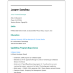
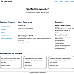
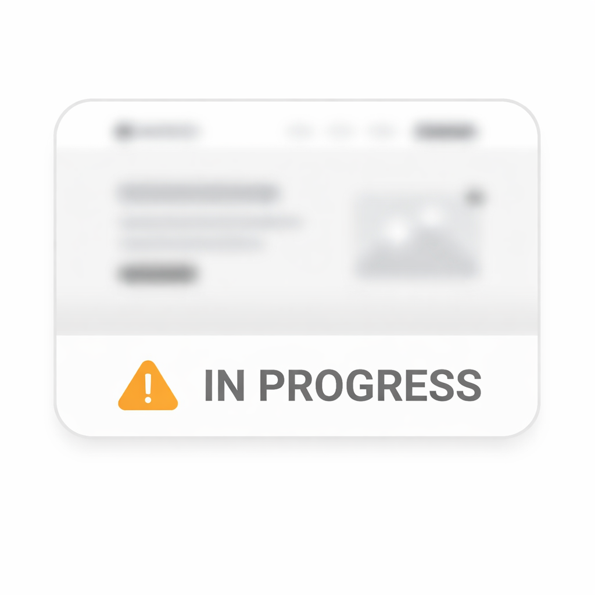

# Roadmap.sh Projects

## 🎨 Frontend Progress (1/24 Complete)

<table>
  <tr>
    <td>
      <a href="./frontend/01-single-page-cv">
        
         <strong>Single Page CV</strong> 
      </a>
      <a href="https://roadmap.sh/projects/single-page-cv">Project Details</a> 
      ✅ Complete
    </td>
    <td>
      <a href="./frontend/02-basic-html-website/">
        
         <strong>Basic HTML Website</strong> 
      </a>
      <a href="https://roadmap.sh/projects/basic-html-website">Project Details</a> 
      ✅ Complete
    </td>
    <td>
      <a href="./frontend/03-personal-portfolio">
        
         <strong>Personal Porfolio</strong> 
      </a>
      <a href="https://roadmap.sh/projects/portfolio-website">Project Details</a> 
      🚧 Ongoing
    </td>
  </tr>
</table>

## **[View All Frontend Projects (3/24) →](./frontend)**

## 🎯 Goal

Master the fundamentals and deepen your understanding of what happens under the hood.

## 💼 Background

- 3+ years as Full Stack Developer (Python Django, ReactJS)
- Collabera Digital JUMP Program graduate
- Built production applications but realized fundamental gaps exist

## 🛠️ Production Experience

## 📫 Connect

