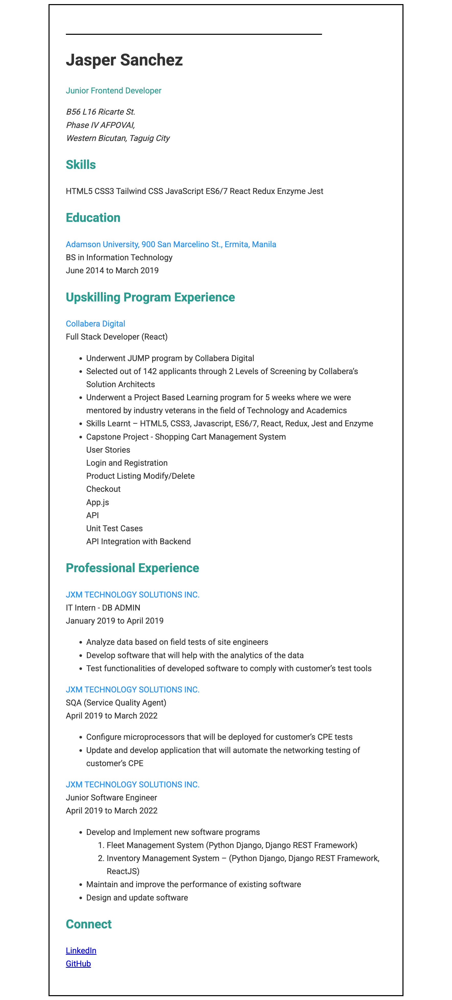

### ✅ Project #1 - Single Page CV

**Tech Stack:**  

**What I learned:**

- Semantic HTML5 structure
- SEO meta tags implementation
- Open Graph social sharing
- Professional CV layout

**Links:** [Live Demo](#) • [Project Brief](https://roadmap.sh/projects/single-page-cv)

**Status:** ✅ Complete
