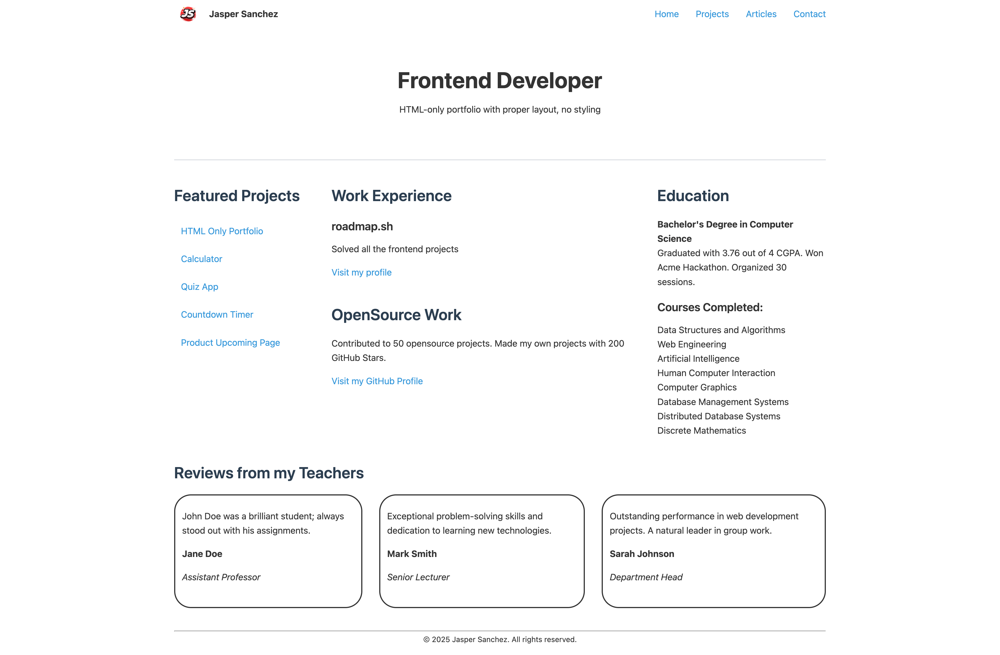

### ✅ Project #2 - Basic HTML Website

**Tech Stack:**  


**What I learned:**

- Multi-page navigation structure
- HTML forms with validation
- CSS layouts (Grid/Flexbox)
- Semantic HTML best practices

**How to view:**

```bash
# Clone the repository
git clone https://github.com/yourusername/roadmap-projects.git

# Navigate to project
cd roadmap-projects/frontend-projects/02-basic-html-website

# Open in browser (choose one):
# Windows
start index.html

# Mac
open index.html

# Linux
xdg-open index.html

# Or just double-click index.html in your file explorer!
```

**Status:** ✅ Complete

[](./preview.png)
